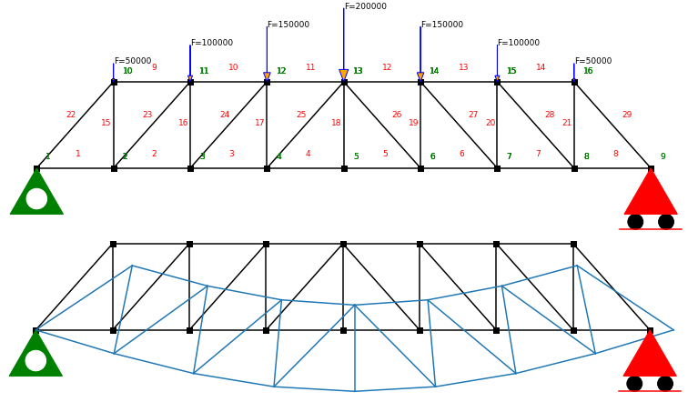

# Calculador de Estructuras Planas

<div align="center">
     
</div>

Código de cálculo matricial (direct stiffness) para el cálculo de pórticos planos y celosías. 
Código adaptado del paquete anaStruct (https://github.com/ritchie46/anaStruct) para las prácticas 
de las asignaturas Estructuras I y II del grado de Edificación de la Universidad de Granada UGR

## Instalación

```
$ !pip install git+https://github.com/EnriqueGarMac/Estructuras_I_II.git
```


